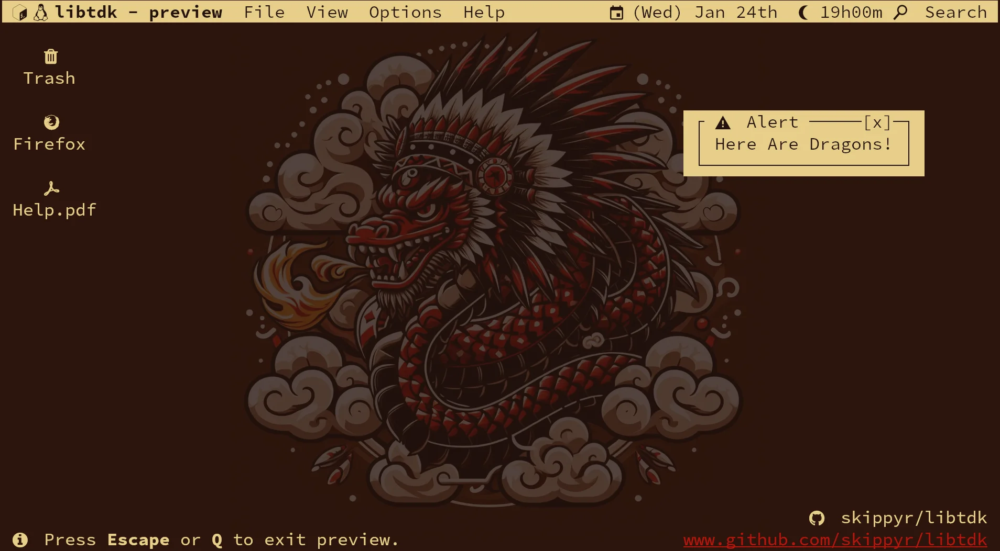

<p align="center">
	
</p>
<h1 align="center">≥v≥v&ensp;libtdk&ensp;≥v≥v</h1>
<p align="center">Terminal Development Kit</p>
<p align="center">
	
	&nbsp;
	
	&nbsp;
	
	&nbsp;
	
</p>

## ❡ About

A simple C99 terminal manipulation library for Linux that is capable of handling some terminal properties, styles and key readings with UTF-8 encoding.

Designed to be an alternative to curses-like libraries, it offers a solid base for creating general purpose terminal based softwares, while leaving room to full-feature libraries to be built upon for more specific use cases.

<p align="center"></p>
<p align="center"><sup><strong>Caption:</strong> a preview of an user interface made with libtdk (available as the file tools/preview.c). The terminal theme used is <a href="https://github.com/skippyr/flamerial">flamerial</a> and font is <a href="https://github.com/be5invis/Iosevka">iosevka</a>.</sup></p>

## ❡ Install

### Dependencies

The following dependencies are required to install it:

- **git**: it will be used to clone this repository.
- **gcc**, **make**: they will be used to compile and install it.

### Procedures

Using a terminal, follow these steps:

- Clone this repository using git:

```sh
git clone https://github.com/skippyr/libtdk;
```

- Access the repository directory using cd:

```sh
cd libtdk;
```

- Use make to compile and install it:

```sh
sudo make install clean;
```

- Export the following environment variables in your shell startup file:

```sh
export LIBRARY_PATH=${LIBRARY_PATH}:/usr/local/lib;
export LD_LIBRARY_PATH=${LD_LIBRARY_PATH}:/usr/local/lib;
```

- Reopen your shell.

## ❡ Uninstall

Using a terminal, follow these steps:

- Go back to the repository directory.
- Use make to uninstall it:

```sh
sudo make uninstall;
```

## ❡ Documentation

After installed, you can refer to its manual pages by using man:

```sh
man tdk.3;
```

## ❡ Help

If you need help about this project, open a new issue in its [issues page](https://github.com/skippyr/libtdk/issues) or send me an [e-mail](mailto:skippyr.developer@gmail.com) describing what is going on.

## ❡ Contributing

This project is open to review and possibly accept contributions, specially fixes and suggestions. If you are interested, send your contribution to its [pull requests page](https://github.com/skippyr/libtdk/pulls) or to my [e-mail](mailto:skippyr.developer@gmail.com).

By contributing to this project, you must agree to license your work under the same license that the project uses.

## ❡ License

This project is licensed under the BSD-3-Clause License. Refer to the LICENSE file that comes in its source code for license and copyright details.
